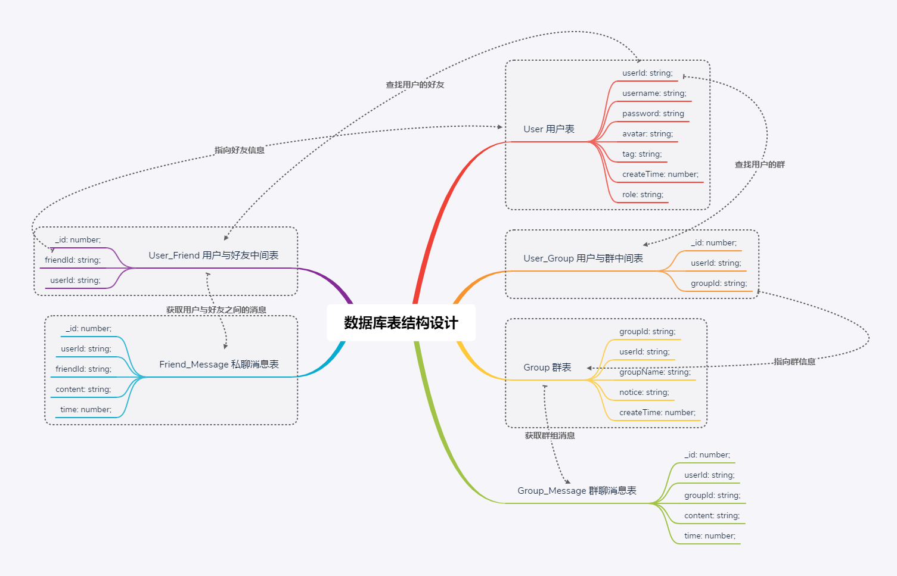

# XTUXTU-Chat

## 项目界面

### PC端

### 移动端

## 功能介绍

- 移动端兼容
- 用户信息的修改(头像/用户名/密码)
- 群聊/私聊
- 创建群/加入群/退群/模糊搜索群
- 添加好友/删好友/模糊搜索用户
- 消息分页
- 表情包
- 图片发送/图片预览
- 在线人数统计
- 自定义主题
- 重连提醒

## 技术概览

- **Typescript**：JavaScript 的一个超集，它最大的优势是提供了类型系统和提高了代码的可读性和可维护性。
- **Vue2.6.x**：前端渐进式框架。
- **Socket/io**：实现实时通信，websocket第三方库。
- **Vuex**：专为 Vue.js 应用程序开发的状态管理模式。
- **Nestjs**：是一个用于构建高效、可扩展的 Node.js 服务端应用框架，基于 TypeScript 编写并且结合了 OOP1、FP2、FRP3 的相关理念。
- **Typeorm**: 支持最新的 JavaScript 特性并提供额外的特性以帮助你开发任何使用数据库的应用程序。
- **ES6+**：采用ES6+语法，箭头函数、async/await等等语法很好用。
- **SASS(SCSS)**：用SCSS做CSS预处理语言，可以使用最高效的方式，以少量的代码创建复杂的设计。

### 数据库表结构设计



### 环境配置

- 数据库mysql 以及 chat数据库 (注意数据库格式为utf8mb4)
- node v10.16.3

### 运行项目

1. 前端项目

```js
cd genal-chat-client 
npm i
npm run serve
```

2.mysql配置
如果mysql连不上并报错error: ER_NOT_SUPPORTED_AUTH_MODE， 是mysql版本不兼容导致，参考[这篇文章](https://blog.csdn.net/qq_41831345/article/details/83150502)
数据库没有sql脚本，直接改后端`app.module.ts`中的数据库密码，新建个`chat`数据库了就行

3.后端项目

```js
cd genal-chat-server
npm i
npm run start:dev
```

### 如何部署

[XTU聊天室部署说明](./XTU聊天室部署说明.md)
